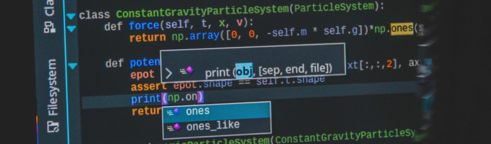

# Engineering Manager Hub
The aim of this repository is to provide a curated list of resources for, begineer as well as seasoned, software engineering managers. Top-down approach in delivering the information is used in order for the reader to find the valuable information right away and if he or she needs more in-depth insight, a link to more detailed articles/resources should be provided. Not every single concept in this repository is linked to a more detailed resource as it might come from my own on-the-job notes. 

Engineering Manager will be further addressed as *EM*.

## Role Definition
What is *really* is to be an Engineering Manager? What tasks does it involve and what are the boundaries of what you should or should not do? This is one of the questions that I have (and still am) asking myself. There is no only one and always followed definition of the role and it can vary greatly per organization. Therefore, the number one advice is to:

```When starting at a new organization, you should always seek a role definition for Engineering Mangager```

It could be in terms of main responsiblities, objectives, deliverables. Anything that will help you to naild down your role and that should become your mantra going forward for instance when deciding about whether you should join an architectural discussion with your team or not. In one organization this could be a main responsibility, in other, this would be too much of an intervention.

* [Engineering manager vs. tech lead -- which is better?](https://www.rubick.com/engineering-manager-vs-tech-lead/)
* 

## Recruitment
Hiring people into your team is probably the most crucial task on your engineering manager list. Without the right people, nothing will move forward. The following are observations/rules of thumb and resources that might come in hand.

1. Hire Slowly
2. Always Make a Hands-On Case Interview
3. Actively Recruit on Community Sites Like Stackoverflow or Github
4. Go for great talend and not longetivity
5. Culture and personality fit over coding excellency
6. Aim for people that build things in their own free time

* [21 Rules of Thumb for Managing Software People and Teams](https://www.informit.com/articles/article.aspx?p=1984066)
## Objectives Key Results (OKRs)


## Team Structure
Should you follow the Scrum to the point that everyone is an engineer/developer or should you have dedicated QAs, Architects etc. on your team?

* [Dedicated QA vs. Developer/Engineering Testing](https://www.informit.com/articles/article.aspx?p=1984066)
## People Development
You need to make sure that you and your reports find together the *hyperdrive* that will keep them engaged and motivated in their career. This is illustrated as follows.


test
sdfds
f
ds
fs
df
## 1-1s
### First 1-1 With Your New Report

`* How do you like to be praised? Public/Private`
`* What is your preffered method of communication for serious feedback? in writing, so you have time to digest it and have it in writing for your reference or just normal talk at a 1-1 session`
`* Why did you decide to work here?`
`* What makes you excited about your work?`
`* How do I know that you are annoyed or in a bad mood?`
`* Is there any manager behavior that you hate/dont like?`
`* Are there any clear career goals that I should be aware of? Do you feel like that you are on a good track to reach those goal(s)?`
`* Any surprises since you joined? positive or negative`

*source*: The Manager's Path: A Guide for Tech Leaders Navigating Growth and Change
### Recommended Books
The following list of books are not a must read but a *very nice to read* and what I particularly find useful about them is how much to the practical point they all are. There is very little fluff and you mostly find practical and tangible examples or advices. I would also say that it does not matter whether you are an engineering manager already or you are aspiring to the role. However, reading it in paralel with your engineering manager role could be the most beneficial time of reading (as long as you have time for it).

| Book        | Link & Description |
| ----------- | ----------- |
|  | [Inspired: How to Create Tech Products Customers Love](https://www.goodreads.com/book/show/35249663-inspired?from_search=true&from_srp=true&qid=xKqWTrRcF0&rank=1) | Marty Cagan's book Inspired is a well-known best-seller and by some called a must-read. I can |
|    | [The Manager's Path: A Guide for Tech Leaders Navigating Growth and Change](https://www.goodreads.com/book/show/33369254-the-manager-s-path)|
| | [Building Great Software Engineering Teams: Recruiting, Hiring, and Managing Your Team from Startup to Success](https://www.goodreads.com/book/show/26341904-building-great-software-engineering-teams)|
## License
[](https://opensource.org/licenses/MIT)

See the explanation of the [MIT License](https://opensource.org/licenses/MIT) here..
