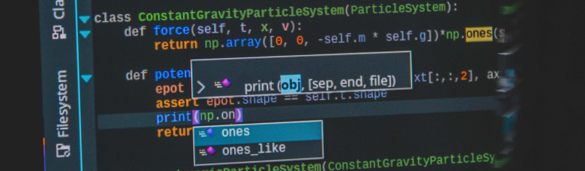

# Awesome Engineering Manager
The aim of this repository is to provide a curated list of resources for, beginner as well as seasoned, software engineering managers. The repository will contain links to all interesting resources within categories that are part of the job of an engineering manager - **The Team, The Technology, The Product & The Process**. Contributions and feedback are welcomed!
## Table of Contents
  * [The Team](#the-team)
  * [The Technology](#the-technology)
  * [The Product](#the-product)
  * [The Process](#the-process)
 
## The Team
### Engineering Manager
* [Engineering manager vs. tech lead -- which is better?](https://www.rubick.com/engineering-manager-vs-tech-lead/)
* [Tech Lead vs Engineering Manager 👑](https://refactoring.fm/p/the-role-of-tech-leads-and-engineering)
* [Gaining a sense of acomplishment as a manager](https://developers.mews.com/accomplishment-as-a-manager/)
* [How to excel in engineering management](https://developers.mews.com/accomplishment-as-a-manager/)

### Team Structure
* [Dedicated QA vs. Developer/Engineering Testing](https://www.informit.com/articles/article.aspx?p=1984066)
* [How to Build a Great Software Development Team](https://builtin.com/software-engineering-perspectives/software-development-team)
### Recruitment
* [21 Rules of Thumb for Managing Software People and Teams](https://www.informit.com/articles/article.aspx?p=1984066)
* [How to make a job ad that no developer can resist](https://devskiller.com/developer-job-ad/)

### People Development
* [Software Engineering and IKIGAI](https://jeewanthalahiru.medium.com/software-engineering-and-ikigai-4facafe7e9a7)
### Career Track for Software Engineers
* [Mews Systems - Career Track](https://github.com/MewsSystems/org/blob/main/tech/career-framework/career-tracks/readme.md)
* [Etsy Engineering Career Ladder](https://etsy.github.io/Etsy-Engineering-Career-Ladder/competencies.html)
* [EngineeringLadders.com](http://www.engineeringladders.com/)

### 1-1s
* [How to Have More Effective One on One Meetings with Your Developers](https://waydev.co/one-on-one-developers/)

## The Technology
### Code Reviews
* [How to build an effective code review process for your team](https://leaddev.com/code-reviews-docs/how-build-effective-code-review-process-your-team)
* [Google Engineering Practices - How to do a code review](https://google.github.io/eng-practices/review/reviewer/)
### Architecture
* [Software architecture diagrams as text](https://dev.to/simonbrown/series/7622)

### Version Control
* [Git Branching Strategies vs. Trunk-based Development](https://launchdarkly.com/blog/git-branching-strategies-vs-trunk-based-development/)
* [Comparing Git Workflows: What You Should Know](https://www.atlassian.com/git/tutorials/comparing-workflows)
* [GitFlow considered harmful](https://www.endoflineblog.com/gitflow-considered-harmful)
* [Git Flow vs Github Flow](https://www.geeksforgeeks.org/git-flow-vs-github-flow/)
## The Product
### Prioritization
* [Product Prioritization Frameworks](https://www.productboard.com/glossary/product-prioritization-frameworks/)
## The Process
### Objectives Key Results (OKRs)
* [How to Make Your Teams Beat OKRs](https://developers.mews.com/how-to-make-your-teams-beat-okrs/)
### Engineering Productivity & Culture
* [The Definitive Guide to DORA Metrics](https://www.leanix.net/en/wiki/vsm/dora-metrics)
* [Google - The DevOps Research and Assessment (DORA) - Technical Capabilities](https://cloud.google.com/architecture/devops)
* [How To Calculate Velocity in Scrum](https://www.zeolearn.com/magazine/how-calculate-velocity-in-scrum)
* [Microsoft - CSE Code-With Engineering Playbook](https://microsoft.github.io/code-with-engineering-playbook/)
## Recommended Books
* [Inspired: How to Create Tech Products Customers Love](https://www.goodreads.com/book/show/35249663-inspired?from_search=true&from_srp=true&qid=xKqWTrRcF0&rank=1)
* [The Manager's Path: A Guide for Tech Leaders Navigating Growth and Change](https://www.goodreads.com/book/show/33369254-the-manager-s-path)
* [Building Great Software Engineering Teams: Recruiting, Hiring, and Managing Your Team from Startup to Success](https://www.goodreads.com/book/show/26341904-building-great-software-engineering-teams)
* [The Making of a Manager: What to Do When Everyone Looks to You](https://www.goodreads.com/book/show/38821039-the-making-of-a-manager)
* [Ask Your Developer: How to Harness the Power of Software Developers and Win in the 21st Century](https://www.goodreads.com/book/show/48716700-ask-your-developer)

## License

See the explanation of the [MIT License](https://opensource.org/licenses/MIT) here..
